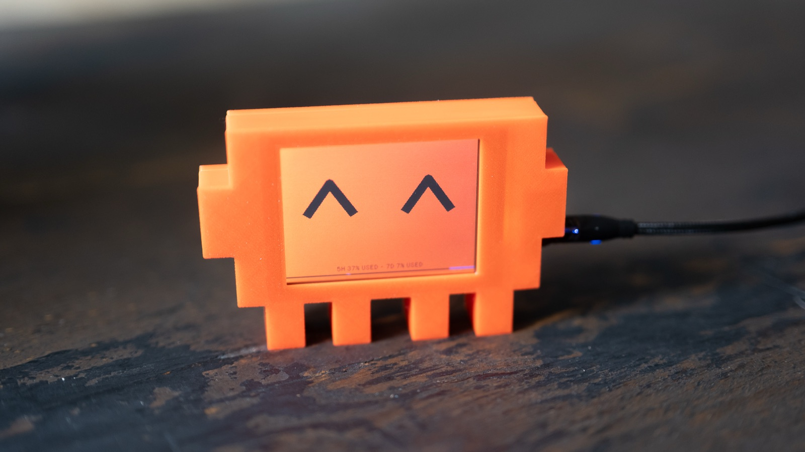
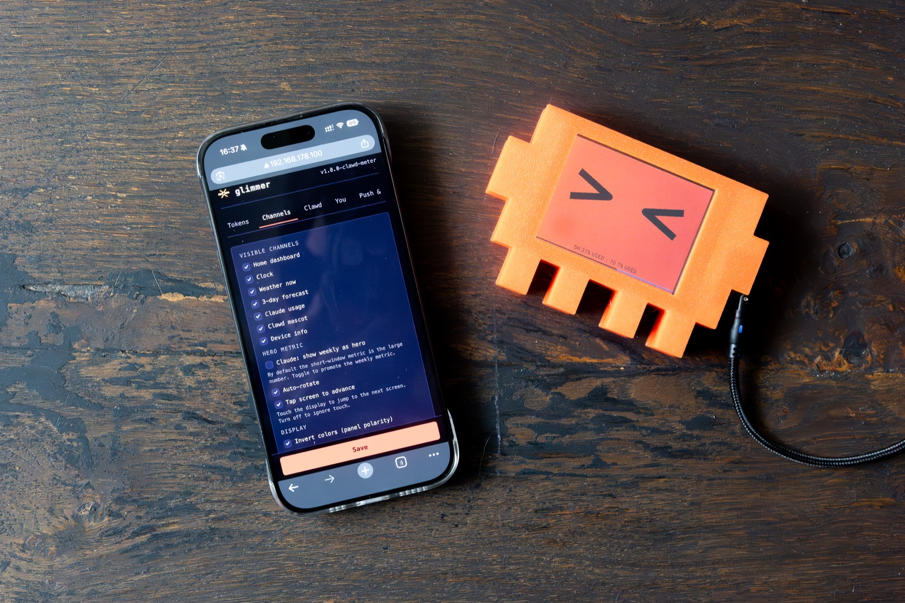

# clawd-meter 🦀

> A tiny pixel-art desk buddy that shows your **Claude usage** at a glance — and
> gives it a face: **Clawd**, an animated mascot whose mood follows how much of
> your quota is left. Runs on a cheap (~10 €) ESP32 colour display.



> Clawd's eyes follow your Claude usage, and you configure everything from a
> little web page on the device:



clawd-meter is a Claude-only remix of [glimmer](https://github.com/Avinava/glimmer)
(usage dashboard + channel engine) combined with the mascot idea from
[clawd-mochi](https://github.com/yousifamanuel/clawd-mochi) (the animated eyes).

---

## What it shows

It rotates through several little screens (and you can tap the screen or use the
web settings to switch):

- **Clawd** — the animated mascot. In *auto* mode his eyes reflect your Claude
  5-hour usage; in *manual* mode you pick the expression.
- **Home** — clock + weather + both Claude windows (5-hour & weekly) + a 24-hour bar.
- **Claude usage** — 5-hour % + weekly % + reset countdowns + per-model breakdown.
- **Clock**, **Weather**, **5-day Forecast** (weather needs no key).
- **Info** — IP, Wi-Fi, uptime, firmware.

---

# 🛠️ Build your own — beginner guide

You don't need to be a programmer. The whole thing takes ~15 minutes.

## 1. What you need

| Part | Notes |
|---|---|
| **ESP32-2432S028R** — the "Cheap Yellow Display" (CYD) | 2.8" 320×240 touchscreen, ~8–12 €. Search "ESP32 2432S028R". Get the **single micro-USB** variant. |
| **USB data cable** | Must be a *data* cable, not charge-only. |
| A computer with **Chrome or Edge** | For the one-click web flasher. |
| (optional) **3D-printed stand/case** | See the model on Makerworld 👇 |

> **3D model:** the printable case is on Makerworld → **<https://makerworld.com/de/models/2906020-clawd-meter>**.

## 2. Flash the firmware (no software to install)

We flash a ready-made file straight from your browser.

1. **Download** the firmware: go to the [latest release](../../releases/latest)
   and download **`clawd-meter-full-esp32-cyd.bin`**.
2. **Plug** the CYD into your computer with the USB data cable.
   - On Windows you may need the USB driver
     ([CP210x](https://www.silabs.com/developers/usb-to-uart-bridge-vcp-drivers) or
     [CH340](https://www.wch-ic.com/downloads/CH341SER_EXE.html)). macOS/Linux usually need nothing.
3. Open the web flasher: **<https://espressif.github.io/esptool-js/>** in Chrome/Edge.
4. Set **Baudrate** to `921600`, click **Connect**, and pick the port that
   appears (it'll say something like *CP2102* / *CH340* / *USB Serial*).
5. Under *Flash Address*, type **`0x0`**, click **Choose File** and select the
   `clawd-meter-full-esp32-cyd.bin` you downloaded.
6. Click **Program** and wait until it says done (~1 min). That's it. ✅

*(Prefer the command line? `esptool.py --chip esp32 write_flash 0x0 clawd-meter-full-esp32-cyd.bin`)*

## 3. First-time setup (Wi-Fi)

1. After flashing, the device shows a setup screen and creates its own Wi-Fi
   hotspot called **`glimmer-setup`**.
2. On your phone or laptop, **connect to `glimmer-setup`** (open network, no password).
3. A page should pop up — if not, open **<http://192.168.4.1/>** in your browser.
4. Go to the **Wi-Fi** tab, enter your home Wi-Fi name + password, **Save**.
   The device reboots and joins your network.
5. From now on, reach the settings page at **<http://glimmer.local/>** (or the
   device's IP address, shown on the *Info* screen).

## 4. Connect your Claude account (get your session key)

This makes the usage screens and Clawd's mood work. You copy one value from your
browser:

1. On a computer, log in to **<https://claude.ai>** in Chrome/Edge.
2. Press **F12** to open Developer Tools.
3. Go to the **Application** tab → left sidebar **Cookies** → **`https://claude.ai`**.
4. Find the row named **`sessionKey`** and copy its **Value**
   (a long string starting with `sk-ant-sid02-…`).
5. Open the device page (**glimmer.local**) → **Tokens** tab → paste it into
   **Session key** → **Save**.

Within a minute the Claude screens fill in and Clawd starts reacting. 🎉

> The session key is like a temporary password to your own Claude account. Keep
> it private. It eventually expires — if usage stops updating, repeat step 4.

## 5. Make it yours (web settings)

Open **glimmer.local** and explore the tabs:

- **Channels** — turn screens on/off, auto-rotate, and **tap-to-advance** (touch the screen to skip to the next one).
- **Clawd** — auto/manual mode, expression, animation speed, **eye & background colour** (presets or a custom `#hex`), and a **"show usage stats"** toggle (off → just the eyes, no footer/bar). There's a **live preview**.
- **You** — brightness, highlight colour, **used vs remaining %** (defaults to *used* — the actual consumption), timezone, night-dimming, your name.

### Clawd's moods (auto mode)

The eyes keep your chosen colour; the **shape** shows the mood:

| Your Claude 5-hour usage | Clawd |
|---|---|
| under 20% used (tons left) | excited ( ✦ ✦ ) |
| 20–40% used | happy ( ^ ^ ) |
| 40–60% used | squish ( > < ) |
| 60–80% used | normal (blinks + looks around) |
| 80–95% used | stressed (worried brows) |
| 95% or more used (maxed out) | dizzy ( ✕ ✕ ) |
| no data yet | sleepy |

---

## Updating later

Grab the newest `clawd-meter-full-esp32-cyd.bin` from
[releases](../../releases/latest) and repeat step 2. (This resets settings; you
can re-enter them, or back up first via **Device → Config backup**.)

## For developers (build from source)

[PlatformIO](https://platformio.org/) required.

```bash
git clone https://github.com/monsierfux/clawd-meter.git
cd clawd-meter
pio run -e cyd -t buildfs   # filesystem (fonts + web UI)
pio run -e cyd              # firmware
pio run -e cyd -t upload    # flash firmware over USB
pio run -e cyd -t uploadfs  # flash filesystem over USB
```

`-t uploadfs` wipes saved settings (it rewrites the whole filesystem). Back up
first with `curl http://<device-ip>/api/export` and restore via the setup AP
(`POST /api/import`).

## Support

If clawd-meter made you smile, you can buy me a coffee — it's hugely appreciated ☕

[](https://ko-fi.com/monsieurfux)

## Credits

Built on two MIT-licensed projects — thank you to both:

- **[glimmer](https://github.com/Avinava/glimmer)** by Avinava — the usage
  dashboard, channel engine, web UI and TFT_eSPI rendering this is based on.
- **[clawd-mochi](https://github.com/yousifamanuel/clawd-mochi)** by Yousuf
  Amanuel — the animated Clawd mascot idea, re-implemented here on TFT_eSPI.

Clawd is the pixel-crab mascot from Claude Code by Anthropic. This is an
independent fan project — **not** affiliated with, sponsored by, or endorsed by
Anthropic.

## Disclaimer — personal & educational use only

clawd-meter reads your own Claude usage by sending **your own credentials** (a
`sessionKey` cookie) to an internal endpoint claude.ai uses to power its web UI.
**That endpoint is undocumented and not part of a public API.** It can change
without notice, and accessing it programmatically may be inconsistent with
Anthropic's Terms of Service depending on interpretation. You are responsible for
your own ToS compliance, your devices/accounts/network, and for securing your
credentials (stored on the device in plaintext). Shared as-is, no warranty. Do
not redistribute as a commercial product; do not access accounts that aren't yours.

## License

MIT — see [LICENSE](./LICENSE). Bundled fonts — **DM Mono** (UI/body) and
**Jersey 25** (big numerals) — are under the SIL Open Font License.
